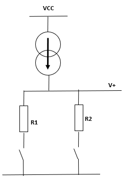

CAHIER DE SUIVI - SOLENE GUILLAUME
==
SEANCE I - 01 Sept : Présentation du projet
-
Lots de cette séance, nous avons recu des explications sur le projet Ruche connectée.   

### Ruche connectée #

INSERER IMAGE SCHEMA RUCHE CONNECTEE
La ruche connectée est divisé en plusieurs projets différents.  Notre promo prend la suite de ce qui est existant.
ENUMERER CE QUI EXISTE
  Trois grosses parties sont à créer ou bien à continuer.
- La station météo (à continuer)
- Lutte contre les parasites
- Communication GSM et WiFi

Nous nous occuperons de la partie station météo.   
Il nous faudra pour ceci créer une interface utilisateur affichant les données météorologiques captées.  

### Matériel à disposition #
- Pluviomètre
- Anémomètre
- Girouette
- Capteur de luminosité (TSL2591)
- Capteur de température, d'hydrométrie et de pression atmosphérique (BME/BMP280)
- Microcontroleur ESP32 

### Avancées #

- Présentation du projet
- Choix du sujet
- Prise en main de Github
- Création du Repository sur Github
- Organisation du Repository
- Ajout des documents et liens utiles dans le repository
- Creation du fichier de cahier de suivi
- Prise en main du langage markdown 

SEANCE II - 02 Sept : Recupération des fichiers
-

- Recupération du schéma et du PCB 
  - Pluviomètre = connecteur gauche et girouette = connecteur droit
- Recupération du GitHub de l'année dernière
  - Lecture des documents 
- Sur Arduino : installation des libraires ESP32 et LoRa
- Outils : Carte ESP32 Dev et Port COM3
- Test des codes donnés l'année dernière : ne fonctionnent pas
- Creation d'un code pour tester compilation et bon fonctionnement de la carte : les leds s'allument

SEANCE III - 09 Sept : Commencement du code du pluviomètre
-
- Recompilation du code des Leds sur Arduino
- Separation des taches
  - Ambre : Pluviomètre et Anémomètre
  - Solène : Girouette  
- Lien pour infos du materiel https://www.lextronic.fr/anemometre-pluviometre-girouette-compatible-arduino-microbit-grove-63661.html
- Lien pour code Arduino sur le matériel : http://atelier-meteo-arduino-lycee-vincendo.blogspot.com/p/le-pluviometre.html
- La Girouette donne 16 valeurs selon la direction d'où vient le vent
  - Impossible de téléverser le code
  - L'année dernière, les eleves ont fait un pont diviseur de tension. En le testant, il est apparu que les mesures de tension prises n'ont pas satisfait car trop proches. 
  - A la place, Monsieur Peter nous a conseillé de renmplacer la résistance principale par un générateur de courant.
  - Les prochaines séances, nous allons nous concentrer sur les autres appareils.
 - Concernant le pluviomètre et l'anémomètre :
  -   l'interrupeur fait des rebonds. Il faut pour ceci faire en sorte dans notre code de ne pas prendre en compte ces faux rebonds pour ne pas fausser la mesure.

SEANCE IV - 15 Sept : Pluviomètre
-
- Probleme sur pluviomètre : Ne detectait pas les fronts montants
  - Avec l'aide de M. Peter, de l'oscilloscope et du schéma, nous avons compris que V+ n'etait pas assez alimenté
  - Ceci car des transistors étaient bloqués. Il faut les rendre passants. Sur arduino : mettre la pin MEASURE à HIGH
  - Maintenant V+ est alimenté et les transitions 0 --> 1 franches. Le code marche et nous arrivons à avoir un compte des clics.
- Grace à l'ajout l'année dernière d'un condensateur, nous n'avons plus de rebonds entre chaque incrémentation. Le compte est propre.
- Pour l'anemometre : nous arrivons compter les switchs. Il faut maintenant reflechir à un code viable pour compter les switchs : interruption de timer otutes les secondes

SEANCE V - 3 oct : Anemomètre et Girouette
-
- Sur mon ordi : probleme avec le port COM3. Pendant le téléversement, un message d'erreur apparaît. IL faut mettre en loader pile au message "Connecting...."
- Pour palier le probleme, essai de telecharger Arduino et de otut reinstaller sur ma VM linux : finalement inutile puisque probleme en partie résolu et impossible car pas assez d'espace de stockage sur la VM
- Ambre a continué sur l'anémomètre
- J'ai commencé sur la girouette :
  - Il faut mettre le MEASURE à HIGH avant de declarer tout le reste dans la boucle set up
  - Je peux récupérer des valeurs de la girouette mais elle ne dépendent pas de la position de la girouette et se décrémentent de 255 à 0.  

SEANCE VI - 13 octobre : Anémomètre et Girouette
-
- Lien github de station meteo : https://github.com/StationMeteoDIY
- Girouette : un pont diviseur de tension ne convient pas car la tension est instable. Il nous faut alors un generateur de courant.
- Nous choisissons le LM334DT que nous programmerons pour générer un courant de 0,01 mA (La resistance equivalente max etant de 120K)
-
- Prochaine seance : faire le schema et souder sur la carte ? (ne pas oublier d'enlever la resistance du pont diviseur de tension originel)

SEANCE VII - 28 Octobre : Girouette (Générateur de courant) et BME280
-
- Schéma et board Eagle du petit module générateur de courant finis. PCB usiné pour la semaine prochaine.
- Commencé le code du BME280. Mais n'arrive pas à le compiler (Problème de librairie ?)

SEANCE VIII - 25 Novembre : Girouette
-
- Module générateur de courant testé. Valeurs de tension stockées dans un excel
- Module soudé sur le board principal
- Test du module : des valeurs autres que celles de la tension sortent sur la console. Nous en avons 16, stockées sur un tableau excel
- Pour la prochaine fois : finir le code (indiquer la direction de la girouette pour chaque valeur)

SEANCE X - 01 Décembre : Makefile
-
- Girouette fonctionnelle et envoie les données désirées.
- Installation de la commande make sur Windows. Voici la procédure : 
  - Ouvrir le terminal de commande en administrateur 
  - Installer chocolatey en saisissant la commande suivante : `@"%SystemRoot%\System32\WindowsPowerShell\v1.0\powershell.exe" -NoProfile -InputFormat None -ExecutionPolicy Bypass -Command "[System.Net.ServicePointManager]::SecurityProtocol = 3072; iex ((New-Object System.Net.WebClient).DownloadString('https://community.chocolatey.org/install.ps1'))" &amp;&amp; SET "PATH=%PATH%;%ALLUSERSPROFILE%\chocolatey\bin"`
  - Fermer et rouvrir le terminal de commande en administrateur
  - Installer la commande make en saisissant : `choco install make`
  - Fermer et rouvrir l'invite de commande avant de faire un make
 - Finalement tout ceci inutile car pas besoin d'un makefile sur arduino : https://arduino.stackexchange.com/questions/60656/split-up-arduino-code-into-multiple-files-using-arduino-ide#:~:text=There%20is%20no%20need%20to%20use%20an%20%23include,the%20rest%20of%20the.ino%20files%20in%20alphabetical%20order.
 - Code d'Ambre pour luminosité, pression, température et humidité foncionnel -> besoin d'installer la librairie BME 280 sur mon PC

SEANCE XI - 09 Décembre : Makefile
-
- "Makefile" terminé
  - Actualisation des valeurs toutes les 10 secondes
- Compilation très longue
  - Intallation d'Arduino sur VM linux : Compilation très rapide mais pas moyen d'utiliser une board ESP32 sur l'IDE :-(
- Prochaine séance : Mettre en forme les données pour les envoyer via LoRa 

SEANCE XII - 20 Décembre : LoRa
-
